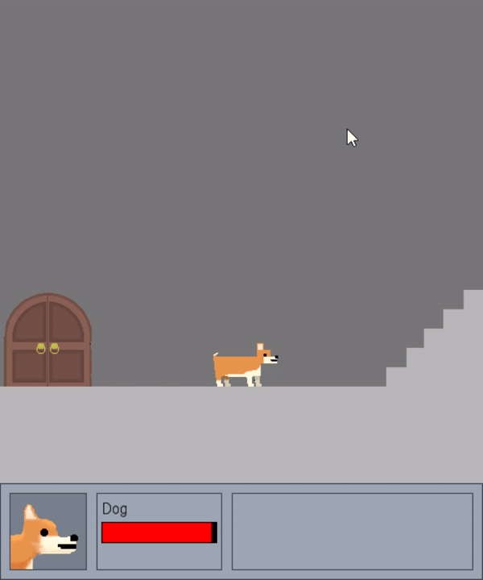

  <a href="{{site.baseurl}}/">Home</a> |
  <a href="{{site.baseurl}}/Projects/">Projects</a> | 
  <a href="{{site.baseurl}}/">Home again</a> | 
  <a href="{{site.baseurl}}/">Home once more</a>

## Completed Projects

### Soliatre

#### Description
This is a version of Solitaire is one I made in Java last year.
If you know how to play Solitaire then you know how to play this as it is almost identical to any other game of Solitaire
Bouncing Cards included.

[Link to the Code](https://github.com/SealDoGaming/Soliatre)

### Dog Game Remasterized Edition Deluxe

#### Description
This was the result of me remaking a little game I made when I first learned how to code. This was my first real big project I worked on and has many big features such as...
- Animation
- Dialog
- Options Sliders
- A Level Editor with GUI

Unfornuately I never finished making it as I did not know how to go forward with it creatively. Making story, characters, enemies, and other key game components would have been exausting for me to develope. The game also being turn-based did not help either.
I may remake it again in the future with these things in mind.
